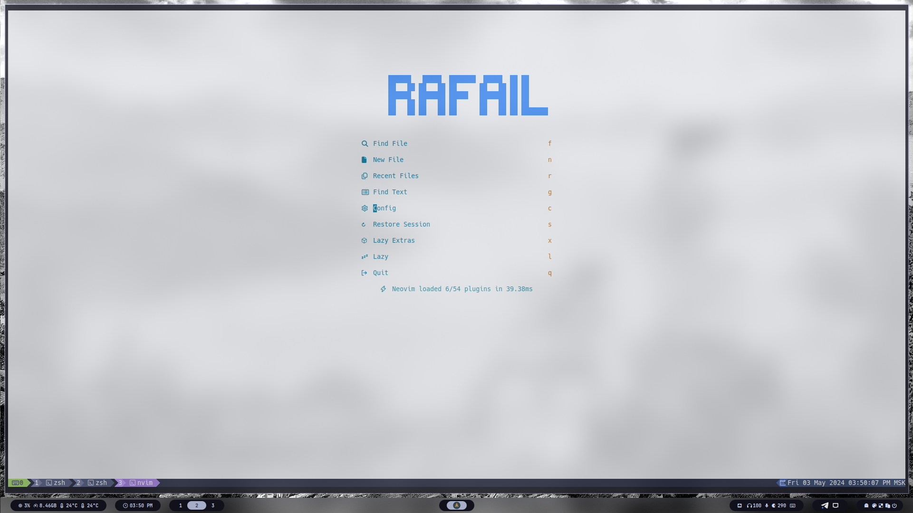
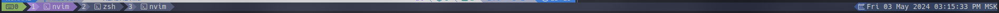

## My personal dot***REMOVED***les

### Pictures
#### Neovim

#### Tmux powerline


### Stack:

- Neovim
- Alacritty
- Kitty
- Tmux
- Hyprland (hyprdots)

### Install

```shell
$ git clone https://github.com/rafailmdzdv/dot***REMOVED***les.git ~/.dot***REMOVED***les && cd ~/.dot***REMOVED***les
$ ls -l | grep -Po '(kitty|nvim|alacritty)' | xargs -I{} ln -s ~/.dot***REMOVED***les/{} ~/.con***REMOVED***g
$ ln -s ~/.dot***REMOVED***les/zsh/.zshrc ~/.zshrc
$ ln -s ~/.dot***REMOVED***les/tmux/.tmux.conf ~/.tmux.conf
```

##### Install [TPM](https://github.com/tmux-plugins/tpm) for tmux.
